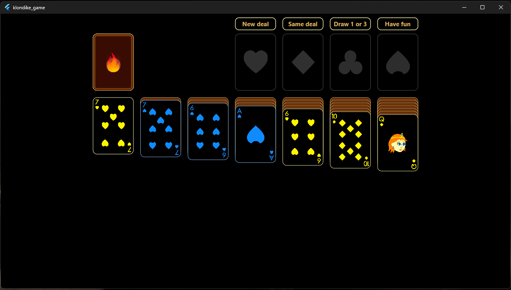
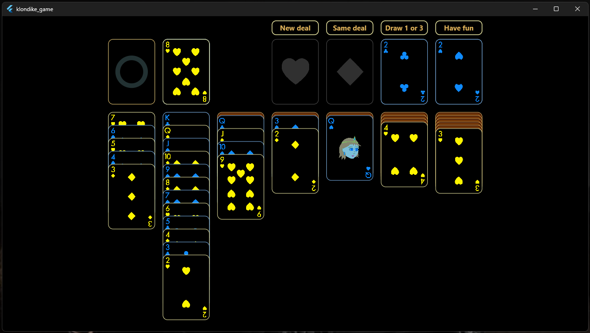
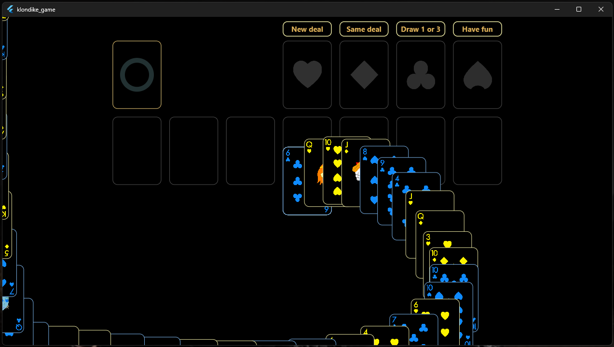
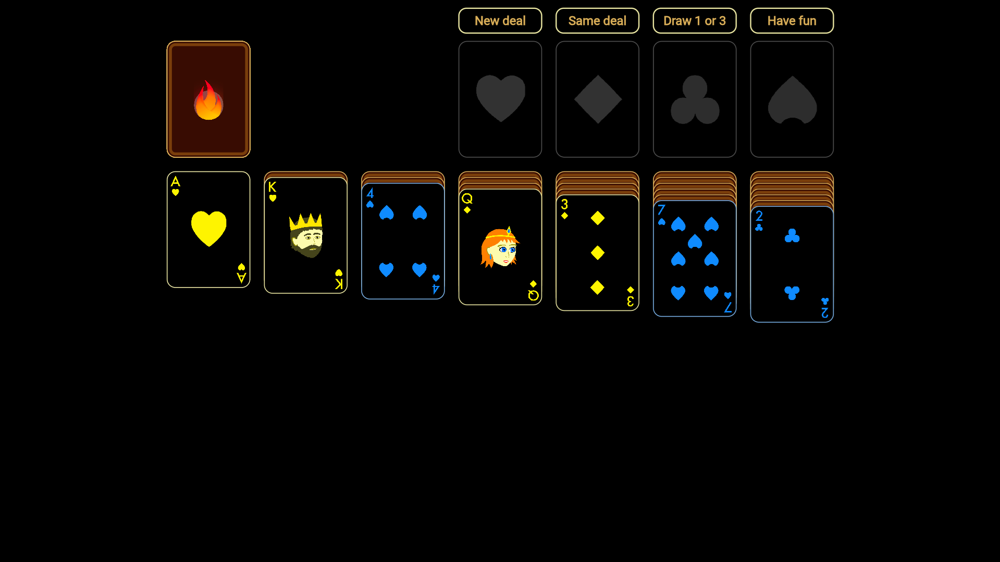
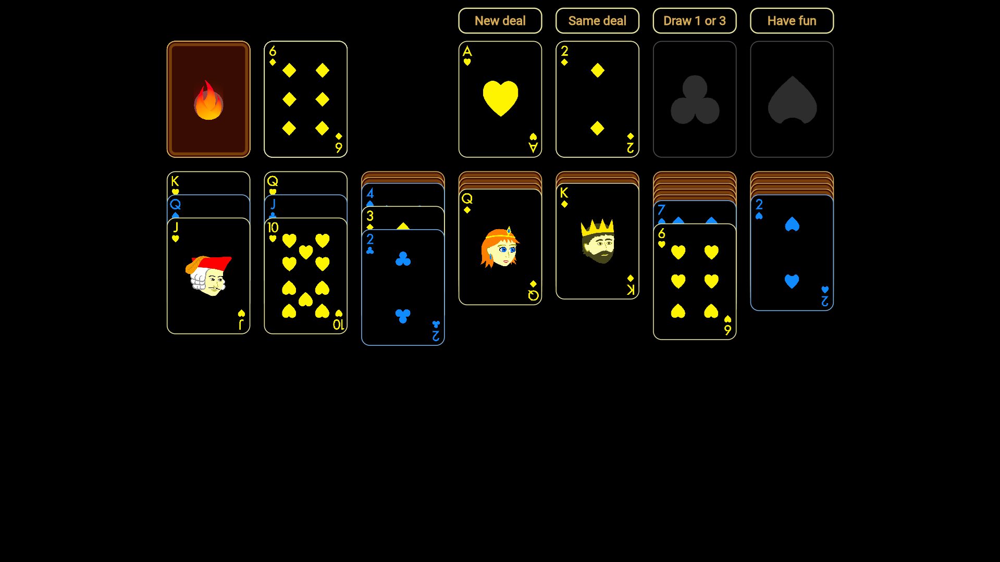
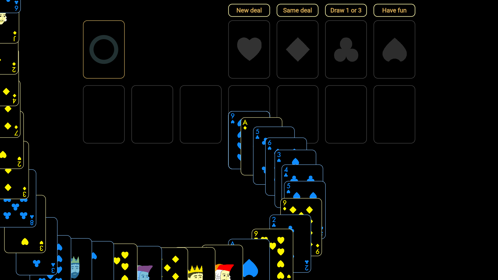
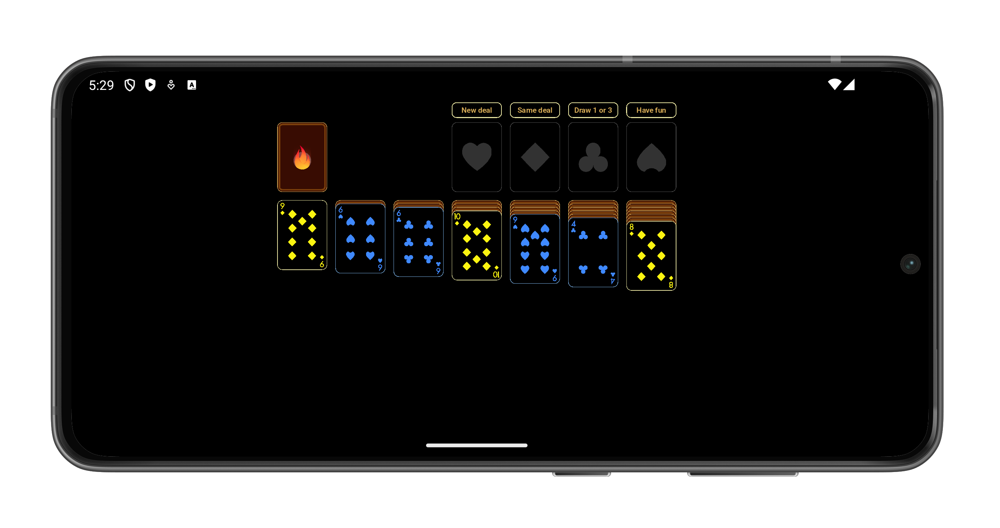
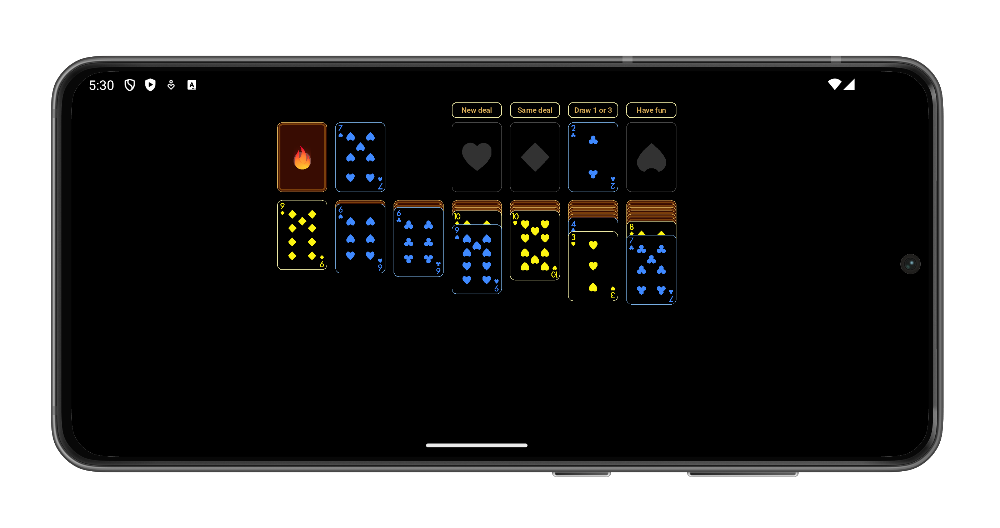
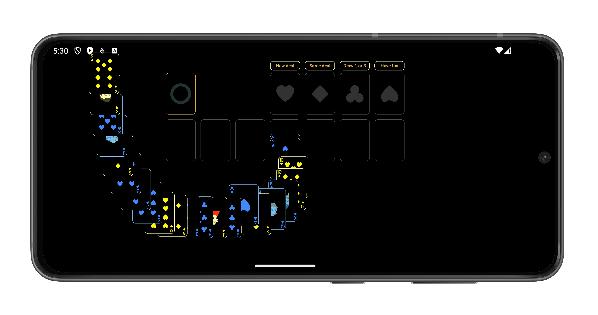

# ♠️ Klondike Game

> _A classic Solitaire card game built with Flutter and Flame, playable on Web, Android, and Windows._

---

## 🎮 About

**Klondike Game** is a modern take on the classic Solitaire game, developed using the [Flame](https://flame-engine.org) game engine in Flutter. It offers smooth gameplay, responsive animations, and a familiar card-stacking challenge across multiple platforms—**Web**, **Android**, and **Windows Desktop**.

---

## 🧰 Tech Stack

- **Game Engine:** [Flame](https://flame-engine.org)
- **Framework:** Flutter
- **Platform Support:** Web, Android, Windows
- **Language:** Dart

---

## 🛠 Development Environment

- **Flutter SDK:** `v3.29.0`
- **Dart SDK:** `v3.7.0`

---

## ✨ Features

- 🃏 Classic Klondike Solitaire rules
- 🖱️ Drag-and-drop card interaction
- 🧠 Auto-move and hints (planned)
- 🎨 Smooth animations with Flame engine
- 📱 Cross-platform support
- 💾 Lightweight and offline-capable

---

## 📷 Screenshots

> Screenshots from each platform

### 🖥️ Windows

| Main Menu                                     | Gameplay                                              | Completed Game                              |
|-----------------------------------------------|-------------------------------------------------------|---------------------------------------------|
|  |  |  |

---

### 🌐 Web

| Main Menu                             | Gameplay                                      | Completed Game                      |
|---------------------------------------|-----------------------------------------------|-------------------------------------|
|  |  |  |

---

### 📱 Android

| Main Menu                                     | Gameplay                                              | Completed Game                              |
|-----------------------------------------------|-------------------------------------------------------|---------------------------------------------|
|  |  |  |

---

## 🌐 Live Demo

- 🔗 **Web (GitHub Pages):**  
  [Play Now](https://omnitechphilippines.github.io/klondike-game/)

---

## 📦 Download Releases

- 💻 **Windows (.7z):**  
  [Download for Windows v1.0.7+1](https://github.com/omnitechphilippines/klondike-game/releases/download/v1.0.7%2B1/windows-release-v1.0.7%2B1.7z)

- 📱 **Android (.apk):**  
  [Download for Android v1.0.7+1](https://github.com/omnitechphilippines/klondike-game/releases/download/v1.0.7%2B1/app-release-v1.0.7%2B1.apk)

- 🌐 **Web build (.7z):**  
  [Download Web Build v1.0.7+1](https://github.com/omnitechphilippines/klondike-game/releases/download/v1.0.7%2B1/web-release-v1.0.7%2B1.7z)

> You can also find all versions in the [Releases Page](https://github.com/omnitechphilippines/klondike-game/releases)

---

## 🏁 Getting Started (Development)

### Prerequisites

- Flutter SDK `v3.29.0`
- Dart SDK `v3.7.0`

### Installation

```bash
# Clone the repo
git clone https://github.com/omnitechphilippines/klondike-game.git
cd klondike-game

# Get packages
flutter pub get
